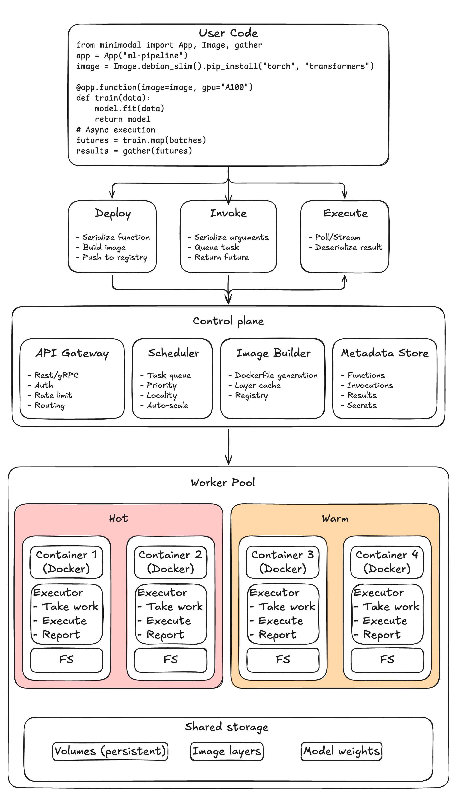

# MiniModal

A minimal serverless platform for learning, inspired by [Modal](https://modal.com).
 
> Read the detailed design discussion in the [blog post](https://distributedhatemachine.github.io/posts/modal/).


## Quick Start

```bash
# Install
uv pip install -e .

# Terminal 1: Start server
uv run python -m minimodal.server.api

# Terminal 2: Start worker  
uv run python -m minimodal.worker.executor

# Terminal 3: Run example
uv run python examples/hello.py
```

## Design Philosophy

- Python script as source of truth - No YAML, no Terraform, no Dockerfiles
- No infra wrestling - Focus on code, not infrastructure
- Tight feedback loop - Change code, see results instantly
- Local-to-cloud feel - Remote execution should feel local

## Project Structure

```
minimodal/
├── minimodal/
│   ├── sdk/          # User-facing API
│   │   ├── app.py           # App class, @function decorator
│   │   ├── function.py      # Function wrapper with .remote(), .spawn()
│   │   ├── image.py         # Docker image builder
│   │   ├── volume.py        # Persistent storage
│   │   ├── secret.py        # Secret management
│   │   ├── web.py           # Web endpoints
│   │   └── client.py        # HTTP client to control plane
│   ├── server/       # Control plane
│   │   ├── api.py           # FastAPI server and WebSocket manager
│   │   ├── models.py        # SQLModel database models
│   │   ├── task_scheduler.py # Multi-tenant task scheduling
│   │   ├── autoscaler.py    # Worker autoscaling logic
│   │   ├── builder.py       # Docker image building
│   │   ├── cron_scheduler.py # Scheduled task execution
│   │   └── routes/          # API endpoints
│   └── worker/       # Task execution
│       └── executor.py      # Worker process and container runner
├── examples/         # Usage examples and demos
└── tests/           # Test suite
```

## Core Features

### Custom Images & Resources

```python
import sys
from minimodal import App, Image

_python_version = f"{sys.version_info.major}.{sys.version_info.minor}"

data_science_image = (
    Image.debian_slim(python_version=_python_version)
    .apt_install("jq", "curl")      # System packages
    .pip_install("numpy")           # Python packages
    .env(PYTHONUNBUFFERED="1")     # Environment variables
)

@app.function(image=data_science_image, cpu=1, memory=512)
def compute_statistics(data: list[float]) -> dict:
    import numpy as np
    arr = np.array(data)
    return {
        "mean": float(np.mean(arr)),
        "std": float(np.std(arr)),
        "min": float(np.min(arr)),
        "max": float(np.max(arr)),
    }
```

### Parallel Execution

```python
# Spawn multiple jobs in parallel
sizes = [50, 100, 150]
futures = [matrix_multiply.spawn(size) for size in sizes]

# Collect all results
from minimodal import gather
results = gather(*futures)
```

### Streaming Functions

```python
@app.function()
def generate_fibonacci(n: int):
    """Generate Fibonacci sequence as a stream."""
    a, b = 0, 1
    for i in range(n):
        yield {"index": i, "value": a}
        a, b = b, a + b

# Stream results as they arrive
for item in generate_fibonacci.spawn(8).stream():
    print(item['value'])  # Prints: 0 1 1 2 3 5 8 13
```

## Advanced Features

- Multi-tenancy - Per-user queues with fair scheduling prevent resource starvation
- Fault Tolerance - Retries with exponential backoff, dead letter queue, circuit breaker
- Autoscaling - Scale up/down based on queue depth with configurable bounds
- Content-Based Caching - Skip rebuilds when dependencies haven't changed

## Installation & Setup

### Prerequisites

- Python 3.10+
- Docker (for container execution)
- [uv](https://github.com/astral-sh/uv) (recommended package manager)

### Install

```bash
# Clone and install
git clone https://github.com/wtfnukee/minimodal
cd minimodal
uv pip install -e .

# Or with pip
pip install -e .
```

### Development Setup

```bash
# Install with dev dependencies
uv pip install -e ".[dev]"

# Run tests
uv run pytest tests/ -v

# Code quality
uv run ruff check
```

## Examples Gallery

| Example | Description |
|---------|-------------|
| `hello.py` | Basic function deployment and execution |
| `example.py` | **Core features showcase** - images, parallel execution, streaming |
| `volumes_example.py` | Persistent storage for datasets and models |
| `secrets_example.py` | Secure secret management for API keys |
| `web_endpoints_example.py` | Expose functions via REST endpoints |
| `cron_jobs_example.py` | Scheduled periodic tasks |
| `comprehensive_example.py` | All features combined in realistic pipeline |

## Architecture Overview

MiniModal uses a three-tier architecture:

1. SDK - User-facing API for defining functions and infrastructure
2. Control Plane - FastAPI server managing functions, scheduling, and task queues
3. Workers - Container-based task execution with resource isolation

### Function Lifecycle

1. Deploy - Serialize function, build container image, store metadata
2. Invoke - Queue task with serialized arguments
3. Execute - Worker deserializes, executes, returns results via WebSocket



## Comparison with Modal

| Feature | MiniModal | Modal |
|---------|-----------|-------|
| Container Runtime | Docker | Firecracker microVMs |
| Storage | SQLite | Distributed DB |
| Image Building | Docker + content caching | Custom layered builder |
| Cold Starts | Basic | Warm pools + snapshotting |
| GPU Support | Planned | Full support |
| Use Case | Learning/Prototyping | Production workloads |

## Development

```bash
# Run all tests
uv run pytest tests/ -v

# Run specific test file
uv run pytest tests/test_api.py

# Code formatting and linting
uv run ruff check
uv run ruff format
```

## Learn More

- **Blog Post**: [Building Modal from scratch](https://distributedhatemachine.github.io/posts/modal/) - Detailed design discussion and implementation insights
- **Repository**: [wtfnukee/minimodal](https://github.com/wtfnukee/minimodal) - Source code and issue tracking
- **Examples**: See `examples/` directory for comprehensive usage examples
